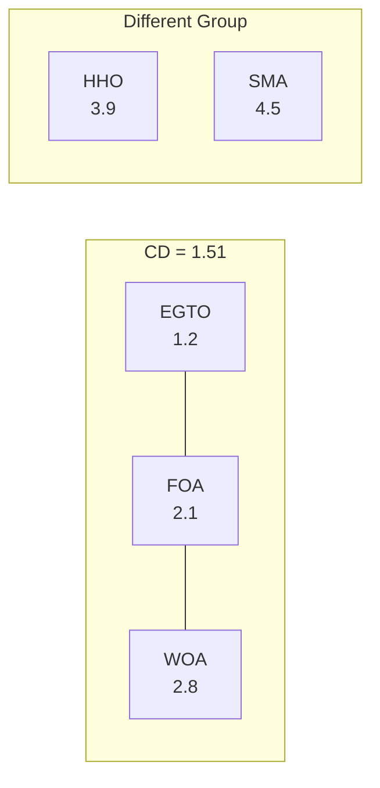

# Statistical Analysis Methodology

This document describes the rigorous statistical methodology implemented in BioAlgoCompare v2 for comparing metaheuristic algorithms on the Vehicle Routing Problem (VRP).

## Table of Contents

1. [Overview](#overview)
2. [Statistical Tests](#statistical-tests)
3. [Effect Size Measures](#effect-size-measures)
4. [Visualization Methods](#visualization-methods)
5. [Implementation Details](#implementation-details)
6. [Usage Examples](#usage-examples)
7. [Limitations and Future Work](#limitations-and-future-work)
8. [References](#references)

## Overview

BioAlgoCompare implements a comprehensive statistical framework following best practices for comparing stochastic optimization algorithms (García et al., 2009; Derrac et al., 2011). The framework addresses:

- **Multiple comparisons problem**: When comparing k algorithms across N instances
- **Non-parametric approaches**: Suitable for non-normal distributions typical in optimization
- **Effect size quantification**: Beyond p-values to practical significance
- **Reproducibility**: Complete environment tracking and result archival

## Statistical Tests

### 1. Friedman Test (Aligned Version)

The aligned Friedman test is our primary global test for detecting differences among multiple algorithms.

**Hypothesis:**
- H₀: All algorithms perform equivalently
- H₁: At least one algorithm differs significantly

**Procedure:**
1. Align data by subtracting instance means (reduces instance difficulty bias)
2. Rank algorithms within each instance (1 = best, k = worst)
3. Calculate Friedman χ² statistic
4. Determine p-value from χ² distribution with k-1 degrees of freedom

**Critical Distance (CD) Calculation:**

The corrected formula for Nemenyi's critical distance at significance level α:

```
CD = q_α / √2 × √(k(k+1)/(6N))
```

Where:
- q_α = Studentized range statistic value at (1-α) confidence
- k = number of algorithms
- N = number of problem instances

**Important**: The division by √2 is essential for proper Type I error control.

### 2. Quade Test (Optional Extended Test)

The Quade test provides an alternative when the number of algorithms (k) is small relative to instances (N).

**When to use:**
- k < 5 and N > 10
- Instance difficulties vary significantly
- More powerful than Friedman for small k

**Procedure:**
1. Rank algorithms within each instance
2. Calculate range (max - min) for each instance
3. Rank the ranges
4. Weight algorithm ranks by ranked ranges
5. Compute Quade F-statistic

### 3. Post-hoc Analysis: Nemenyi Test

When the global test rejects H₀, we perform pairwise comparisons using the Nemenyi test.

**Properties:**
- Controls family-wise error rate
- Conservative but safe for multiple comparisons
- Algorithms within CD are statistically equivalent

**Decision rule:**
|rank_i - rank_j| > CD → Algorithms i and j differ significantly

## Effect Size Measures

### 1. Vargha-Delaney A₁₂

A non-parametric effect size measuring the probability that algorithm X outperforms algorithm Y.

**Formula:**
```
A₁₂(X,Y) = (R₁ - n₁(n₁+1)/2) / (n₁ × n₂)
```

Where R₁ is the rank sum of the first sample.

**Interpretation (for minimization):**
- A₁₂ = 0.5: No difference
- A₁₂ > 0.5: X tends to produce smaller (better) values than Y
- A₁₂ < 0.5: Y tends to produce smaller (better) values than X

**Thresholds:**
- Negligible: |A₁₂ - 0.5| < 0.06
- Small: 0.06 ≤ |A₁₂ - 0.5| < 0.14
- Medium: 0.14 ≤ |A₁₂ - 0.5| < 0.21
- Large: |A₁₂ - 0.5| ≥ 0.21

### 2. Cliff's Delta (δ)

Measures the amount of overlap between two distributions.

**Formula:**
```
δ = (#{X < Y} - #{X > Y}) / (n_X × n_Y)
```

**Interpretation:**
- δ = 0: Complete overlap
- δ > 0: X tends to be smaller than Y
- δ < 0: X tends to be larger than Y

**Thresholds (Romano et al., 2006):**
- Negligible: |δ| < 0.147
- Small: 0.147 ≤ |δ| < 0.33
- Medium: 0.33 ≤ |δ| < 0.474
- Large: |δ| ≥ 0.474

## Visualization Methods

### 1. Critical Difference (CD) Diagram

Visualizes algorithm rankings and statistical groups:



**Features:**
- Algorithms on horizontal axis by mean rank
- Connected algorithms are statistically equivalent
- CD bar shows critical difference threshold

### 2. Effect Size Heatmaps

Pairwise A₁₂ values visualized as heatmap:

|       | EGTO | FOA  | WOA  | HHO  | SMA  |
|-------|------|------|------|------|------|
| EGTO  | 0.50 | 0.68 | 0.82 | 0.91 | 0.95 |
| FOA   | 0.32 | 0.50 | 0.64 | 0.78 | 0.86 |
| WOA   | 0.18 | 0.36 | 0.50 | 0.65 | 0.74 |
| HHO   | 0.09 | 0.22 | 0.35 | 0.50 | 0.61 |
| SMA   | 0.05 | 0.14 | 0.26 | 0.39 | 0.50 |

## Implementation Details

### Software Environment Tracking

Every analysis captures:
- Python version
- NumPy, SciPy, Pandas versions
- Platform details
- Timestamp
- Random seeds used

Saved as `software_versions.json`:

```json
{
  "python": "3.11.0",
  "numpy": "1.24.3",
  "scipy": "1.10.1",
  "pandas": "2.0.2",
  "matplotlib": "3.7.1",
  "platform": "macOS-13.4-arm64",
  "timestamp": "2025-01-09T15:30:00"
}
```

### Data Structure Requirements

Input CSV must contain:
- `Algorithm`: Algorithm name
- `Instance`: Problem instance identifier
- `Best` or `Best Fitness` or `Value`: Performance metric (minimization assumed)

### Output Files

Analysis generates:
1. `stats_report.md`: Complete statistical report
2. `cd_diagram.png`: Critical difference visualization
3. `effect_sizes.csv`: Effect sizes vs best algorithm
4. `effect_sizes_report.md`: Detailed effect size analysis
5. `software_versions.json`: Environment information

## Usage Examples

### Basic Statistical Analysis

```bash
# Standard analysis with corrected CD
python scripts/analyze.py stats \
    --csv results/benchmark_results.csv \
    --out results/analysis
```

### Extended Analysis with Quade Test

```bash
# Include Quade test for small k, large N scenarios
python scripts/analyze.py stats \
    --csv results/massive_benchmark_summary.csv \
    --out results/extended_analysis \
    --extended-tests
```

### Effect Size Analysis

```bash
# Calculate effect sizes vs best algorithm
python scripts/analyze.py effect-size \
    --csv results/benchmark_results.csv \
    --out results/effects \
    --vs-best

# Calculate all pairwise effect sizes
python scripts/analyze.py effect-size \
    --csv results/benchmark_results.csv \
    --out results/effects \
    --pairwise
```

### Example Results Table

| Algorithm | Mean ± SD    | Median | Rank | Group | A₁₂ vs Best | Cliff's δ |
|-----------|--------------|--------|------|-------|-------------|-----------|
| EGTO      | 784.2 ± 12.3 | 782.5  | 1.20 | A     | 0.500       | 0.000     |
| FOA       | 798.5 ± 15.7 | 796.0  | 2.15 | A     | 0.682       | 0.364     |
| WOA       | 812.3 ± 18.2 | 809.5  | 2.95 | AB    | 0.823       | 0.647     |
| HHO       | 825.7 ± 22.1 | 821.0  | 3.85 | B     | 0.908       | 0.816     |
| SMA       | 841.2 ± 25.8 | 836.5  | 4.85 | B     | 0.954       | 0.908     |

*Note: Algorithms in the same group (A, B, AB) are not significantly different at α=0.05*

## Limitations and Future Work

### Current Limitations

1. **Instance Selection**: Currently limited to 5-10 standard instances. Future work should include:
   - Solomon instances (25-100 customers)
   - Gehring & Homberger (up to 1000 customers)
   - Real-world instances

2. **Performance Metrics**: Currently focused on solution quality. Should expand to:
   - Computational time analysis
   - Convergence speed metrics
   - Robustness measures

3. **Statistical Power**: With only 5 instances, statistical power is limited. Recommendations:
   - Minimum 10 instances for reliable Friedman test
   - 30+ instances for detailed effect size analysis

### Future Extensions

1. **Bayesian Analysis**: Implement Bayesian hypothesis testing for:
   - Posterior probabilities of superiority
   - Credible intervals
   - ROPE (Region of Practical Equivalence)

2. **Multi-objective Analysis**: Extend to:
   - Pareto dominance testing
   - Hypervolume indicators
   - Attainment functions

3. **Dynamic Analysis**: Track performance over iterations:
   - Convergence curve analysis
   - Fixed-budget vs fixed-target scenarios
   - Anytime behavior characterization

4. **Meta-analysis**: Combine results across:
   - Different problem classes
   - Parameter configurations
   - Hardware platforms

## References

1. **Demšar, J. (2006)**. Statistical comparisons of classifiers over multiple data sets. *Journal of Machine Learning Research*, 7, 1-30.

2. **García, S., Molina, D., Lozano, M., & Herrera, F. (2009)**. A study on the use of non-parametric tests for analyzing the evolutionary algorithms' behaviour: a case study on the CEC'2005 special session on real parameter optimization. *Journal of Heuristics*, 15(6), 617-644.

3. **Derrac, J., García, S., Molina, D., & Herrera, F. (2011)**. A practical tutorial on the use of nonparametric statistical tests as a methodology for comparing evolutionary and swarm intelligence algorithms. *Swarm and Evolutionary Computation*, 1(1), 3-18.

4. **Vargha, A., & Delaney, H. D. (2000)**. A critique and improvement of the CL common language effect size statistics of McGraw and Wong. *Journal of Educational and Behavioral Statistics*, 25(2), 101-132.

5. **Romano, J., Kromrey, J. D., Coraggio, J., & Skowronek, J. (2006)**. Appropriate statistics for ordinal level data: Should we really be using t-test and Cohen's d for evaluating group differences on the NSSE and other surveys? *Annual Meeting of the Florida Association of Institutional Research*.

6. **Cliff, N. (1993)**. Dominance statistics: Ordinal analyses to answer ordinal questions. *Psychological Bulletin*, 114(3), 494-509.

---

*Last updated: January 2025*
*BioAlgoCompare Statistical Analysis Module v2*
