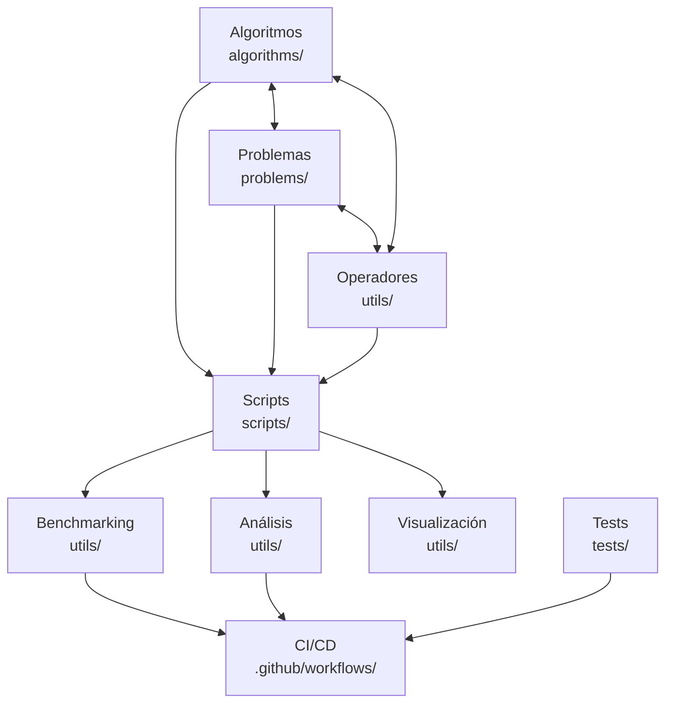

# Arquitectura de BioAlgoCompare

Este documento describe la arquitectura general de BioAlgoCompare, un framework para la implementación, evaluación y comparación de algoritmos metaheurísticos bio-inspirados aplicados al Vehicle Routing Problem (VRP).

## Visión General

BioAlgoCompare está diseñado siguiendo principios de modularidad, extensibilidad y rigor científico. La arquitectura facilita:

1. La implementación consistente de diversos algoritmos bio-inspirados
2. La ejecución reproducible de experimentos de optimización
3. El análisis estadístico riguroso de los resultados
4. La visualización científica de datos de rendimiento

## Diagrama de Componentes



## Inventario de Módulos

### Algoritmos
```
algorithms/
├── aha.py         # Artificial Hummingbird Algorithm
├── apo.py         # Artificial Protozoa Optimizer
├── base.py        # Clase base para algoritmos metaheurísticos
├── egto.py        # Enhanced Gorilla Troops Optimizer
├── ewa.py         # Earthworm Algorithm
├── foa.py         # Fossa Optimization Algorithm
├── fsa.py         # Flamingo Search Algorithm
├── gto.py         # Gorilla Troops Optimizer
├── gvoa.py        # Griffon Vultures Optimization Algorithm
├── hho.py         # Harris Hawks Optimization
├── mrfo.py        # Manta Ray Foraging Optimization
├── opa.py         # Orca Predator Algorithm
├── rro.py         # Raven Roosting Optimization
├── sho.py         # Spotted Hyena Optimizer
├── sma.py         # Slime Mould Algorithm
├── smo.py         # Starling Murmuration Optimizer
└── woa.py         # Whale Optimization Algorithm
```

### Problemas
```
problems/
└── vrp.py         # Implementación del Vehicle Routing Problem
```

### Scripts
```
scripts/
├── analyze.py             # Análisis de resultados experimentales
├── run.py                 # Ejecución de algoritmos individuales
├── run_massive.py         # Benchmarking masivo con checkpoint
└── run_opa_experiment.py  # Experimentos específicos para OPA
```

### Utilidades
```
utils/
├── benchmarking.py                  # Funciones para benchmarking
├── fixed_method.py                  # Métodos corregidos para optimización
├── html_generator.py                # Generación de reportes HTML
├── modify_statistical_analysis.py   # Modificador de análisis estadístico
├── operators.py                     # Operadores genéticos generales
├── statistical_analysis.py          # Funciones de análisis estadístico
├── visualization.py                 # Visualización de resultados
├── vrp_operators.py                 # Operadores específicos para VRP
└── improved/                        # Versiones mejoradas de módulos
    ├── advanced_visualization.py    # Visualización avanzada
    ├── enhanced_benchmarking.py     # Benchmarking mejorado
    └── enhanced_statistics.py       # Estadísticas mejoradas
```

### Tests
```
tests/
├── test_algorithms_regression.py    # Tests de regresión para algoritmos
├── test_cli.py                      # Tests para la interfaz de línea de comandos
├── test_vrp_operators.py            # Tests para operadores VRP
└── test_vrp_parser.py               # Tests para el parser VRP
```

### CI/CD
```
.github/workflows/
└── ci.yml                          # Workflow de integración continua
```

## Componentes Principales

### 1. Algoritmos (`algorithms/`)

La capa de algoritmos contiene las implementaciones de diversos algoritmos metaheurísticos bio-inspirados:

- Cada algoritmo hereda de una clase base abstracta `MetaheuristicAlgorithm`
- Implementan operaciones específicas de búsqueda y optimización
- Interactúan con el problema a través de una interfaz común
- Mantienen y actualizan una población de soluciones candidatas
- Registran curvas de convergencia para análisis de rendimiento

**Patrones de diseño:** Template Method, Strategy.

### 2. Problemas (`problems/`)

Define los problemas de optimización que serán abordados por los algoritmos:

- Actualmente se centra en el Vehicle Routing Problem (VRP)
- Proporciona métodos para:
  - Decodificar soluciones (de representación continua a rutas discretas)
  - Evaluar la calidad de las soluciones (función objetivo)
  - Manejar restricciones (capacidad de vehículos)
  - Cargar instancias estándar de problemas

**Patrones de diseño:** Strategy, Adapter.

### 3. Utilidades (`utils/`)

Módulos utilitarios para diversas funcionalidades:

- **Operadores genéticos** (`operators.py`): Operadores comunes como mutación, cruce, selección
- **Operadores específicos VRP** (`vrp_operators.py`): Operaciones de mejora local para rutas
- **Benchmarking** (`benchmarking.py`): Sistema para ejecución y registro sistemático de experimentos
- **Análisis estadístico** (`statistical_analysis.py`): Pruebas estadísticas para comparación de resultados
- **Visualización** (`visualization.py`): Generación de gráficas y visualizaciones científicas

**Patrones de diseño:** Utility, Facade.

### 4. Scripts (`scripts/`)

Interfaces de línea de comandos para interactuar con el sistema:

- **run.py**: Ejecución de algoritmos individuales o múltiples
- **analyze.py**: Análisis completo y benchmarking
- **run_massive.py**: Benchmarking masivo con checkpoint

**Patrones de diseño:** Command, Facade.

### 5. Tests (`tests/`)

Pruebas automatizadas para garantizar el correcto funcionamiento del sistema:

- **Tests unitarios**: Para componentes individuales
- **Tests de regresión**: Para algoritmos contra instancias conocidas
- **Tests de CLI**: Para validar la interfaz de línea de comandos

**Patrones de diseño:** Test Fixture, Test Suite.

### 6. CI/CD (`.github/workflows/`)

Pipeline de integración continua para asegurar la calidad del código:

- **Linting**: Verificación de estilo y calidad de código con Ruff
- **Tests**: Ejecución automatizada de pruebas
- **Cobertura**: Generación de reportes de cobertura de código

**Patrones de diseño:** Pipeline, Continuous Integration.

## Flujo de Datos

1. **Entrada**:
   - Instancia del problema (archivos .vrp)
   - Configuración del algoritmo (parámetros)
   - Configuración del experimento (semilla, repeticiones)

2. **Procesamiento**:
   - Algoritmos operan sobre el problema
   - Decodificación y evaluación de soluciones
   - Registro de métricas y resultados

3. **Salida**:
   - Soluciones optimizadas
   - Métricas de rendimiento
   - Visualizaciones
   - Informes de análisis

## Aspectos Clave de la Arquitectura

### Reproducibilidad

El sistema está diseñado para garantizar la reproducibilidad científica mediante:

- Control explícito de semillas aleatorias
- Registro completo de parámetros y configuraciones
- Almacenamiento de resultados detallados por corrida en formato CSV
- Sistema de checkpoints para recuperación de ejecuciones largas

### Extensibilidad

Nuevos componentes pueden integrarse fácilmente:

- **Nuevos algoritmos**: Heredando de `MetaheuristicAlgorithm`
- **Nuevos problemas**: Implementando la interfaz de problema
- **Nuevas métricas**: Extendiendo el sistema de benchmarking

### Paralelización

El sistema soporta ejecución paralela para:

- Múltiples ejecuciones independientes
- Benchmarking de múltiples algoritmos
- Análisis estadístico paralelo

### Calidad del Código

La infraestructura de calidad garantiza:

- Estándares consistentes (via Ruff y pre-commit hooks)
- Detección temprana de errores (via pruebas automatizadas)
- Medición de cobertura de código
- Proceso de CI/CD automatizado

## Tecnologías Utilizadas

- **Python**: Lenguaje principal de implementación
- **NumPy**: Operaciones numéricas eficientes
- **Pandas**: Manipulación y análisis de datos
- **Matplotlib/Seaborn**: Visualización científica
- **SciPy**: Análisis estadístico
- **Click**: Interfaces de línea de comandos
- **Pytest**: Framework de pruebas
- **Ruff**: Linting y formateo de código
- **GitHub Actions**: CI/CD

## Decisiones de Diseño

1. **Adaptación continua-combinatoria**: Los algoritmos bio-inspirados, originalmente diseñados para optimización continua, se adaptan al problema combinatorio VRP mediante codificación ordinal (permutaciones).

2. **Interfaz única de algoritmos**: Una clase base abstracta común garantiza que todos los algoritmos puedan ser utilizados, evaluados y comparados de manera consistente.

3. **Separación clara de responsabilidades**: Cada componente tiene una responsabilidad única y bien definida, facilitando el mantenimiento y extensión.

4. **Primero la reproducibilidad científica**: El diseño prioriza el rigor científico y la capacidad de reproducir resultados exactamente.

Este enfoque arquitectónico ha resultado en un sistema modular, extensible y científicamente riguroso para la evaluación comparativa de algoritmos metaheurísticos bio-inspirados.